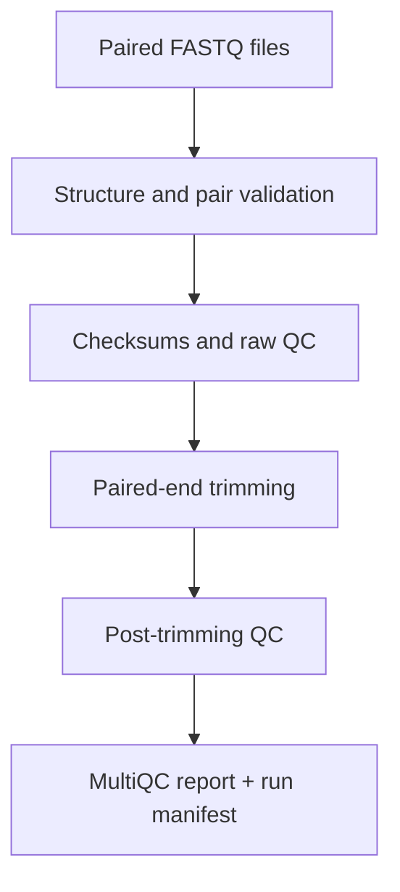

# GenomQC RNA-seq QC Pipeline

[](https://github.com/muhammetozcelik/genomqc-rnaseq-qc/actions/workflows/ci.yml)
[](LICENSE)
[](CHANGELOG.md)
[**Open the GenomQC Decision Report →**](https://muhammetozcelik.github.io/genomqc-rnaseq-qc/)
· [View the example MultiQC report](https://muhammetozcelik.github.io/genomqc-rnaseq-qc/demo/)

GenomQC is a reproducible quality-control and preprocessing workflow for
paired-end RNA-seq FASTQ files. It validates read pairing, records input
checksums and software versions, performs raw and post-trimming QC, and creates
a consolidated MultiQC report.

> Research-use workflow. GenomQC does not perform clinical interpretation or
> diagnostic reporting.

## Browser decision report

The public beta turns MultiQC JSON, TSV or CSV exports into an explainable
sample-level PASS / WARN / FAIL report. Processing is performed locally in the
browser: the selected file is not uploaded to a GenomQC server. Reports can be
downloaded as JSON or printed to PDF.

## What it produces

- structural and pair-integrity validation for FASTQ / FASTQ.GZ inputs;
- SHA-256 checksums for input and output reads;
- raw and trimmed SeqKit statistics;
- raw and trimmed FastQC reports;
- paired-end adapter and quality trimming with fastp;
- a combined MultiQC HTML report;
- a machine-readable run manifest and a complete execution log.

## Workflow



## Quick start

Create the pinned environment:

```bash
micromamba create -f environment.yml
micromamba activate genomqc
```

Run the included example:

```bash
./bin/genomqc \
  --r1 examples/data/demo_R1.fastq \
  --r2 examples/data/demo_R2.fastq \
  --sample demo \
  --output results/demo
```

The main report will be written to:

```text
results/demo/multiqc/genomqc_multiqc.html
```

## Command-line interface

```text
Usage:
  genomqc --r1 FILE --r2 FILE --sample NAME --output DIR [options]

Required:
  --r1 FILE             Read 1 FASTQ or FASTQ.GZ
  --r2 FILE             Read 2 FASTQ or FASTQ.GZ
  --sample NAME         Sample identifier used in output filenames
  --output DIR          Output directory

Options:
  --threads INT         Worker threads (default: 2)
  --cut-mean-quality N  fastp sliding-window mean quality (default: 20)
  --length-required N   Minimum retained read length (default: 20)
  --skip-trimming       Run validation and raw QC only
  --help                Show help
  --version             Show version
```

## Output layout

```text
results/demo/
├── checksums/
│   ├── inputs.sha256
│   └── outputs.sha256
├── logs/
│   └── genomqc.log
├── manifests/
│   └── run_manifest.json
├── multiqc/
│   └── genomqc_multiqc.html
├── raw_fastqc/
├── reports/
│   ├── fastp.json
│   ├── fastp.html
│   ├── raw_seqkit.tsv
│   └── trimmed_seqkit.tsv
├── trimmed/
└── trimmed_fastqc/
```

## Reproducibility

The environment pins the versions of Python, SeqKit, FastQC, fastp and
MultiQC. Each run records:

- UTC start time;
- command-line parameters;
- input paths and SHA-256 checksums;
- software versions;
- output checksums;
- pipeline version.

The repository's CI validates Python behavior, shell syntax, FASTQ error
handling and a complete pipeline run on synthetic paired-end reads.

## Demonstration case

The workflow has been evaluated on a 100,000-pair public RNA-seq subset. It
retained 98.38% of pairs while improving R2 Q30 from 82.28% to 85.41%; the R2
FastQC per-base quality status changed from WARN to PASS. See the
[case study](docs/case-study.md) for parameters and interpretation.

## Scope and limitations

GenomQC covers raw-read validation, QC and conservative preprocessing. It does
not currently include alignment, transcript quantification, differential
expression or biological interpretation. Trimming parameters should be chosen
with the library design and downstream analysis in mind.

## Citation

If you use this workflow in academic work, cite the repository using the
metadata in [CITATION.cff](CITATION.cff).

## License

Released under the [MIT License](LICENSE).

